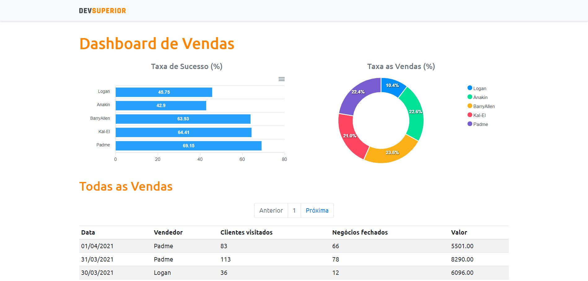

<h1 align="center">
    <strong>DS Vendas</strong>
    <br>Semana DevSuperior 3.0<br/>
    TypeScript | Spring Boot | ReactJS
</h1>

<p align="center">
    
    
    
    <br/>
</p>

<p align="center">
    <a href="#bookmark-sobre-o-projeto">Sobre</a>&nbsp;&nbsp;&nbsp;|&nbsp;&nbsp;&nbsp;
    <a href="#rocket-tecnologias-utilizadas">Tecnologias</a>&nbsp;&nbsp;&nbsp;|&nbsp;&nbsp;&nbsp;
    <a href="#boom-como-executar">Como Executar</a>&nbsp;&nbsp;&nbsp;|&nbsp;&nbsp;&nbsp;
    <a href="#memo-licença">Licença</a>
</p>

<p align="center">
    
<p>

## :bookmark: Sobre o Projeto

O **DS Vendas** é uma aplicação Web que possui o intuito de exibir os dados de vendas, juntamente com porcentagens, taxas de vendas e sucesso.

Essa aplicação foi realizada durante a **Semana DevSuperior 3.0**, projeto da [DevSuperior](https://devsuperior.com.br/).

## :rocket: Tecnologias Utilizadas

- [ApexCharts](https://apexcharts.com/)
- [Bootstrap](https://getbootstrap.com/)
- [date-fns](https://date-fns.org/)
- [Java](https://java.com/)
- [PostgreSQL](https://www.postgresql.org/)
- [ReactJS](https://reactjs.org/)
- [Spring Boot](https://spring.io/)
- [TypeScript](https://www.typescriptlang.org/)

## :boom: Como Executar

- ### **Pré-requisitos**

  - É **necessário** possuir o **[Java 11](https://java.com/)** e **[Spring Boot](https://spring.io/)** instalados no computador.
  - É **necessário** possuir o **[Git](https://git-scm.com/)** instalado e configurado no computador.
  - Também, é **preciso** ter a **[IDE Eclipse](https://spring.io/tools)** instalado no computador para subir o backend.
  - Por fim, é **essencial** ter um gerenciador de pacotes seja o **[Yarn](https://yarnpkg.com/)** ou **[NPM](https://www.npmjs.com/)**.

1. Faça um clone do repositório:

```sh
  $ git clone https://github.com/DanielAraldi/DS-Vendas.git
```

2. Executando a Aplicação:

```sh
  # API
  # Para subir o backend é necessário:
  # > Ir no Spring Tool Suite (STS)
  # > Abrir a pasta src
  # > Clicar com o botão direito em src/main/java
  # > Procurar por "Run As" e ir na opção "Spring Boot App"

  # APLICAÇÃO WEB
  $ cd frontend
  # Instalando as dependências do projeto.
  $ npm install # ou yarn install
  # Inicie a aplicação web
  $ npm run start # ou yarn start
```

## :memo: Licença

Esse projeto está sob a licença MIT. Veja o arquivo [LICENSE](LICENSE) para mais detalhes.

---

<sup>Projeto desenvolvido com a tutoria de [Nélio Alves](https://github.com/acenelio), da [Rocketseat](https://devsuperior.com.br/).</sup>
